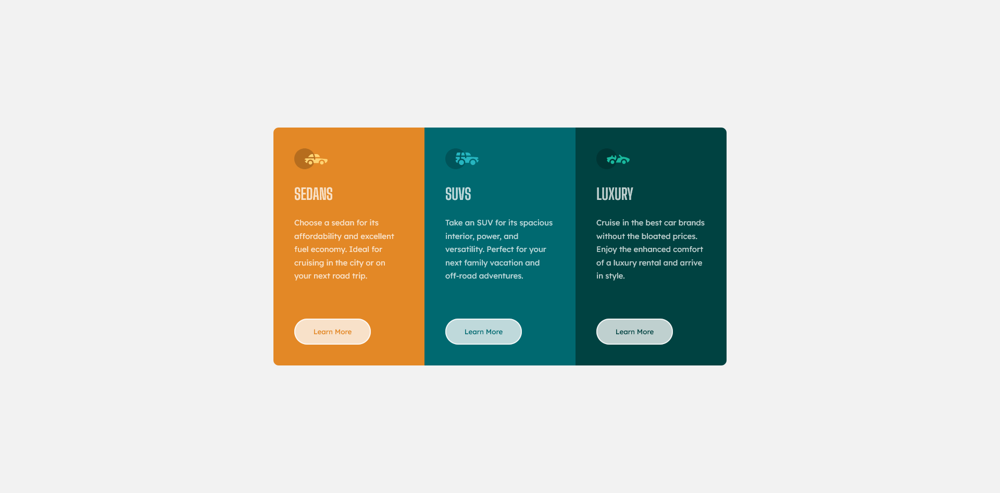

# Frontend Mentor - 3-column preview card component solution

This is a solution to the [3-column preview card component challenge on Frontend Mentor](https://www.frontendmentor.io/challenges/3column-preview-card-component-pH92eAR2-). Frontend Mentor challenges help you improve your coding skills by building realistic projects. 

## Table of contents

- [Overview](#overview)
  - [Screenshot](#screenshot)
  - [Links](#links)
- [My process](#my-process)
  - [Built with](#built-with)
  - [Continued development](#continued-development)
- [Author](#author)

## Overview

### Screenshot

### Links

- Solution URL: [GitHub](https://github.com/Debesta/Frontend-Mentor---3-column-preview-card-component)
- Live Site URL: [Netlify](https://3-column-card-component-debesta.netlify.app/)

## My process

### Built with

- Semantic HTML5 markup
- SCSS custom properties
- Flexbox
- Mobile-first workflow

### Continued development

Nothing new, but I train my skills.

## Author

- GitHub - [@Debesta](https://github.com/Debesta)
- Frontend Mentor - [@Debesta](https://www.frontendmentor.io/profile/Debesta)
